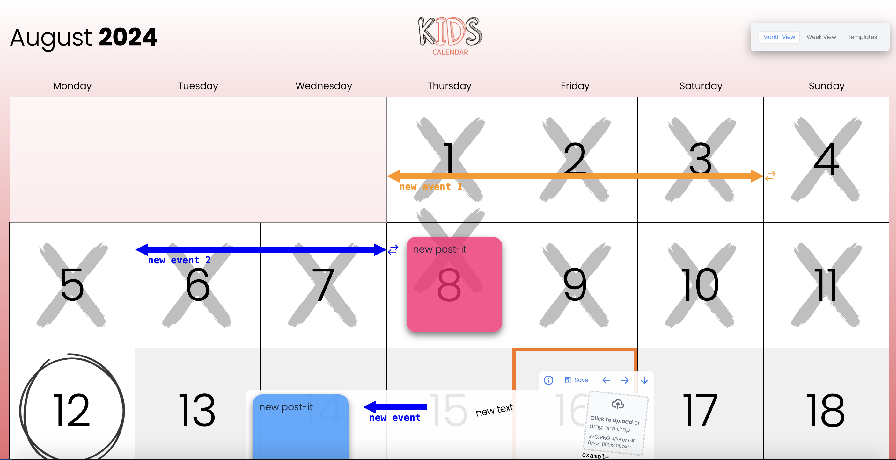

# Kids Calendar

An app to plan kids' schedules and record past events with photos.



## Built with:

- Next-JS 14.
- Azure Cosmos DB

## Dependencies

- [React Dnd Kit](https://dndkit.com/)
- [Zustand](https://github.com/pmndrs/zustand)
- [CosmosDB JS SDK](https://learn.microsoft.com/en-us/javascript/api/overview/azure/cosmos-readme?view=azure-node-latest)

Hosted on:

- Azure Container Apps

# Get Started

This is a [Next.js](https://nextjs.org/) project bootstrapped with [`create-next-app`](https://github.com/vercel/next.js/tree/canary/packages/create-next-app).

## Getting Started

Install NPM packages

```bash
npm i
# or
yarn i
```

Run the development server:

```bash
npm run dev
# or
yarn dev
```

Production Build

```bash
npm run build
# or
yarn build
```

Open [http://localhost:3000](http://localhost:3000) with your browser to see the result.

## Docker

To build a docker image run

```bash
docker build . -t calendar
```

## Deployment

The repo is currently setup to build and push to an Azure Container Registry via a Github Action. See the **./github/workflows** folder.
